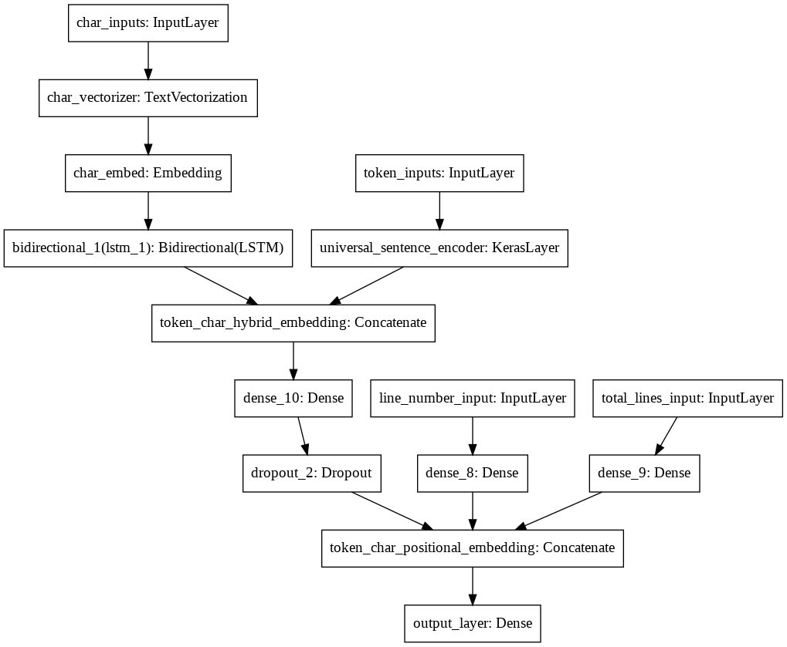
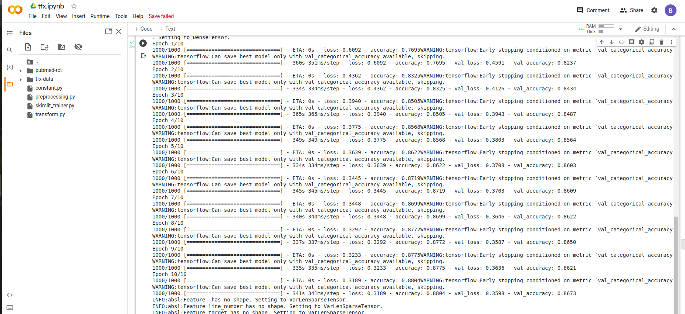

# skimlit_tfx_pipeline
This repo  mimic's  Neural Networks for Joint Sentence Classification in Medical Paper Abstracts paper with TFX pipeline 

Dataset used: https://github.com/Franck-Dernoncourt/pubmed-rct.git
pudmed 200k Dataset is used for the model

model architecture: Model described in this https://arxiv.org/pdf/1612.05251.pdf paper is recreated using tensorflow 2.x

In this model 2 embedding layers are used
1) universal_sentence_encode (pre-trained layer) from tf-hub for sentence embedding
2) own embedding layer for character embedding.

TFX is used to created pipeline:
components used:
1) ExampleGen Component helps to inject the data into pipeline this will return tf records
2) Statisticsgen Component helps to get the descriptive stats about our data
3) SchemaGen Component helps to get schema of data
4) Examplevalidator Component helps to validate the data using stats and schema
5) Transform Component helps to transform the data and it is done on the go i.e transformation is part of model graph
6) Trainer Component helps to train a model
7) Evaluator Component helps to evaluate the model with others
8) Pusher Component helps to push the model to destination

